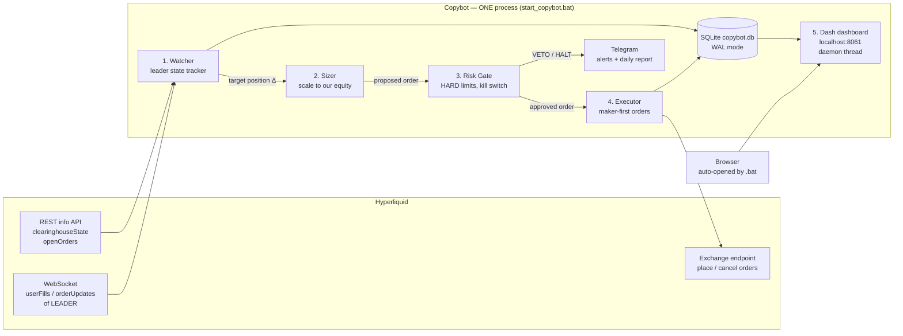
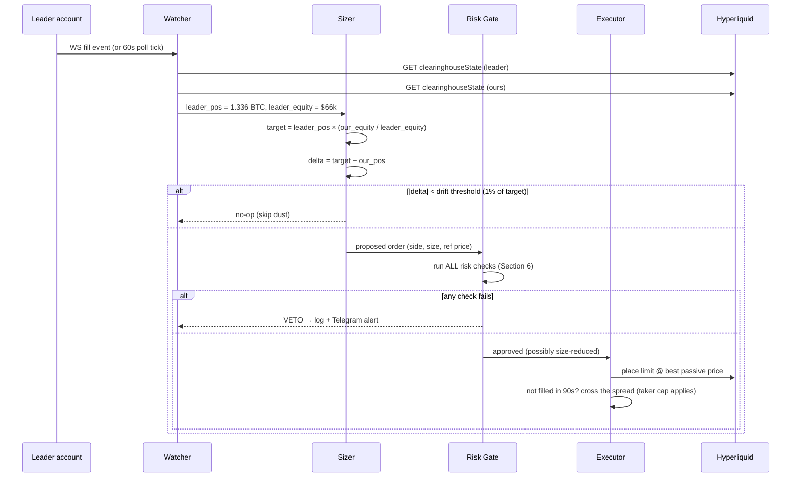
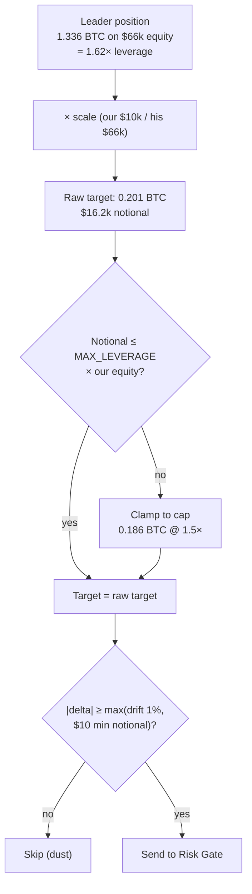
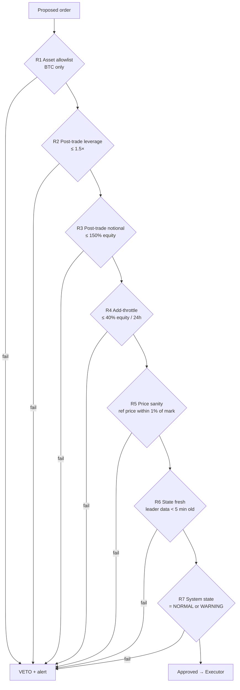
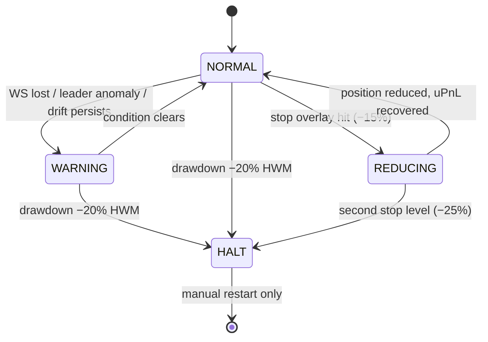
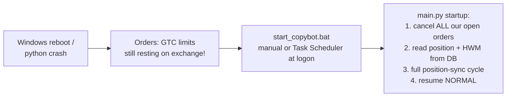

# PRD — Hyperliquid Copybot for `0xdae4...7637` ("Paul Wei")

**Status:** Draft v2.1 · 2026-08-27
**Repo:** `bankkomin/hyperliquid-copybot`
**Leader:** [`0xdae4df7207feb3b350e4284c8efe5f7dac37f637`](https://hyperbot.network/trader/0xdae4df7207feb3b350e4284c8efe5f7dac37f637) — BTC perp only, tracked at [paul.catseye.today](https://paul.catseye.today/)

> **v2 changes:** added data storage schema (§10), dashboard + daily report spec with examples (§11), standalone double-click operation (§12). Dashboard promoted from "optional M4" to core M1 deliverable.

---

## 1. Goal

Mirror the leader's BTC perp exposure on our own Hyperliquid account, scaled to our equity, **with a risk overlay the leader does not have**. Risk management and position sizing are the primary system functions — copying is secondary.

**Standalone requirement:** the whole product is one folder on the VPS. Double-click `start_copybot.bat` → Python runs in the background, the tracking dashboard opens in the browser. No terminal babysitting.

**Non-goals (v1):** multi-leader support, non-BTC assets, spot copying, vault deposits, cloud hosting.

---

## 2. What we learned about the leader (drives the whole design)

From 9 months of on-chain data (1,343 orders, 341 fills, Nov 2025 → Aug 2026):

| Fact | Number | Design consequence |
|---|---|---|
| Style | Long-only laddered accumulation ("grid"-looking) | Copy **position state**, not every fill |
| Maker fills | 84% | If we taker-copy, we pay costs he doesn't → maker-first execution |
| Realized grid PnL | ≈ +$500 net of funding+fees (noise) | The copyable alpha is the **directional position**, not the churn |
| Unrealized PnL | +$20.6k on 1.336 BTC @ $64,249 avg entry | Late copier buys HIS entry at TODAY's price — no entry-price edge |
| Stop losses | **ZERO** (no trigger orders, no TP/SL, ever) | **We must add our own stop overlay** |
| Behavior in drawdown | Averages down, pyramids size (0.05 → 0.20 BTC deeper) | Resting ladder would grow him ~40% bigger into a 28% crash — cap this |
| Fill frequency | ~1.2 fills/day, order batches every 1–2 days | Low-frequency; polling + WS both viable; latency is NOT critical |
| Funding paid | −$1,765 over 9 months (long perp) | Funding monitor needed; long-bias bleeds carry |

> **Key insight:** this leader survived because BTC V-shaped. A copybot that mirrors him 1:1 inherits an **uncapped average-down martingale with no stop**. The risk layer is not optional polish — it is the product.

---

## 3. System overview



Every order flows **Watcher → Sizer → Risk Gate → Executor**. Nothing reaches the exchange without passing the Risk Gate. The gate can only shrink or veto an order, never enlarge it. The dashboard is read-only over SQLite — it can never place an order.

---

## 4. Copy strategy: position-sync, not fill-mirror

Two standard approaches exist in open-source copybots:

| Approach | Used by | Fit here |
|---|---|---|
| **Fill-mirror** — react to each leader fill, replicate it | [zkOSAI](https://github.com/zkOSAI/hyperliquid-copy-trading-bot), [jestersimpps](https://github.com/jestersimpps/hyperliquid-copytrader) | ✗ We'd taker-cross on every maker fill he gets; misses fills during our downtime; drift accumulates |
| **Position-sync** — converge our position toward `leader_position × scale` | [MaxIsOntoSomething](https://github.com/MaxIsOntoSomething/Hyperliquid_Copy_Trader) (startup), jestersimpps (drift sync) | ✓ Self-healing, restart-safe, naturally deduplicates his ladder churn |

**Decision: position-sync is the source of truth.** WS fill events are just *triggers* to re-sync early; a poll timer (60s) is the fallback trigger. This is the same "drift sync" pattern jestersimpps uses (1% drift threshold), promoted from safety-net to primary mechanism.



**Explicitly NOT copied (v1):** the leader's *resting* order ladder (his 14 open buys $57.9k–$73.5k). We only mirror **filled exposure**. Rationale: mirroring resting orders commits our margin to his future average-down before it happens; position-sync picks up those buys anyway *if* they fill, and our risk gate then decides how much of them we take. Order-ladder mirroring is a Phase-2 option behind a config flag.

---

## 5. Position sizing (priority #1)

### 5.1 Core formula

```
scale        = our_equity / leader_equity          # both = perp accountValue, refreshed every sync
raw_target   = leader_position_btc × scale
target       = min(raw_target, POS CAP, LEV CAP)   # caps in Section 6
delta        = target − our_position_btc
order_size   = round_down(delta, sz_decimals)      # BTC: 5 decimals
```

Worked example at current state (our account = $10,000):

```
scale      = 10,000 / 66,435            = 0.1505
raw_target = 1.33557 × 0.1505           = 0.20103 BTC   (~$16.2k notional @ $80.5k)
lev check  = 16.2k / 10k = 1.62×  →  > MAX_LEVERAGE 1.5× → clamp
target     = (10,000 × 1.5) / 80,500    = 0.18634 BTC
```



### 5.2 Sizing rules

| # | Rule | Value (default) | Why |
|---|---|---|---|
| S1 | Equity ratio scaling | `our_equity / leader_equity`, live both sides | Same %-of-account exposure as leader — the standard across all referenced bots |
| S2 | Leverage clamp dominates | `MAX_LEVERAGE = 1.5×` (leader runs ~1.6× and his ladder would push it higher) | We copy his position, **not** his ladder-inflated future leverage |
| S3 | Min notional | $10 (Hyperliquid rule) + our own `MIN_ORDER_USD = 15` | Avoid dust churn; jestersimpps uses 11 |
| S4 | Drift threshold | 1% of target position | Don't chase every $ of equity fluctuation |
| S5 | Max single order | 25% of our equity notional | One bad sync can't dump our full size as one taker order |
| S6 | Rounding | Always round **down** | Never exceed the computed target |
| S7 | Increase-throttle | Position increases limited to `MAX_ADD_PER_DAY = 40%` of equity notional per 24h | Caps how fast we follow his average-down cascade in a crash |

S7 is the direct answer to his martingale ladder: if BTC crashes 28% in a day and all his resting buys fill, a naive copier adds ~40% more exposure into a falling knife within hours. The throttle spreads that across days and gives the drawdown kill-switch (R2) time to fire first.

---

## 6. Risk framework (priority #1, tied)

### 6.1 Hard gates — every order, in order, any failure = veto



### 6.2 Standing monitors (run continuously, independent of orders)

| # | Monitor | Trigger | Action |
|---|---|---|---|
| M1 | **Stop-loss overlay** (leader has none!) | Our position uPnL < **−15%** of equity | Reduce position 50% (maker-first, taker after 90s); repeat at −25% to flat |
| M2 | **Drawdown kill-switch** | Account equity < **−20%** from high-water mark | → HALT: cancel all orders, flatten, stop copying, require manual restart |
| M3 | Leader anomaly | Leader position changes > 50% in < 10 min, or flips short | Pause copying (WARNING), alert — his 16 short fills in 9 months were noise, a real flip is regime change |
| M4 | Funding bleed | Cumulative funding paid > 2% of equity per 30d | Alert only (he paid ~0.6%/mo peak) |
| M5 | Connection watchdog | WS silent > 5 min AND poll fails | → WARNING: cancel our resting orders (never leave unattended limits), keep position, alert |
| M6 | Divergence audit | `our_pos / scale` vs `leader_pos` differs > 5% | Force full re-sync; if it persists 3 cycles → WARNING + alert |

### 6.3 Risk state machine (same shape as the option bot's)



- **NORMAL** — full copying.
- **WARNING** — no new *increases*; decreases/closes still mirrored (never block risk reduction).
- **REDUCING** — stop overlay is working the position down; leader increases ignored.
- **HALT** — flat, no orders, manual intervention required. The bot must never auto-exit HALT.

---

## 7. Execution

Leader earns his economics by being 84% maker. We approximate:

1. Place a **GTC limit at the passive touch** (buy = best bid, sell = best ask).
2. Unfilled after **90 s** → cancel, re-place crossing the spread as IOC, with slippage cap **0.15%** from mark.
3. Fill or partial recorded in SQLite; partial remainder handled by the next sync cycle (position-sync makes retries free).

Closes triggered by risk monitors (M1/M2) skip step 1 patience: 30 s maker attempt, then taker. Getting out matters more than fee savings.

---

## 8. Configuration (single `config.yaml`)

```yaml
leader: "0xdae4df7207feb3b350e4284c8efe5f7dac37f637"
assets: ["BTC"]

sizing:
  mode: equity_ratio          # our_equity / leader_equity
  max_leverage: 1.5
  max_notional_pct: 150       # % of equity
  max_add_per_day_pct: 40
  min_order_usd: 15
  drift_threshold_pct: 1.0
  max_single_order_pct: 25

risk:
  stop_loss_upnl_pct: -15     # reduce 50%
  stop_loss_flat_pct: -25     # go flat
  max_drawdown_pct: -20       # HALT (from high-water mark)
  leader_staleness_max_s: 300
  funding_alert_pct_30d: 2.0

execution:
  maker_wait_s: 90
  maker_wait_close_s: 30
  taker_slippage_cap_pct: 0.15

storage:
  db_path: "data/copybot.db"
  snapshot_interval_s: 60

dashboard:
  port: 8061
  refresh_s: 15
  daily_report_utc: "00:05"   # also posted to Telegram

mode: paper                   # paper | live  — paper is the default, always
telegram: { enabled: true }
```

---

## 9. Tech stack & repo layout

Match the option bot's conventions — same developer, same review muscle memory:

- **Python 3.10+**, asyncio, official [`hyperliquid-python-sdk`](https://github.com/hyperliquid-dex/hyperliquid-python-sdk)
- **SQLite** (WAL mode) for all state + append-only audit log
- **Plotly Dash** for the tracking dashboard (same stack as the option bot's dashboard — reuse the dark theme CSS)
- **structlog** JSON logging to `logs/`, **Pydantic** models, **pytest**
- Own venv inside the repo (`venv\`) — the bare-`python` hijack gotcha applies here too; the `.bat` always calls `venv\Scripts\pythonw.exe` by explicit path

```
hyperliquid-copybot/
├── start_copybot.bat       # double-click: bot + dashboard in background, opens browser
├── stop_copybot.bat        # double-click: clean shutdown
├── config.yaml
├── requirements.txt
├── venv/                   # local venv (not committed)
├── data/
│   └── copybot.db          # SQLite — the single source of truth
├── logs/
│   ├── copybot.jsonl       # structlog output (rotated daily)
│   └── copybot.pid         # written on start, used by stop_copybot.bat
├── reports/
│   └── daily-YYYYMMDD.html # self-contained daily report snapshots
├── src/
│   ├── main.py             # async loop wiring + Dash daemon thread + pid file
│   ├── watcher.py          # WS subscribe + poll, leader/our state snapshots
│   ├── sizer.py            # §5 — pure function, fully unit-tested
│   ├── risk.py             # §6 — gates + monitors + state machine, pure where possible
│   ├── executor.py         # §7 — order placement, maker-first
│   ├── store.py            # §10 — SQLite schema, writes, snapshot reads
│   ├── dashboard.py        # §11 — Dash app, reads SQLite only
│   └── report.py           # §11.3 — daily HTML + Telegram summary
└── tests/
```

Sizer and risk gate are **pure functions** (state in → decision out) so every rule in Sections 5–6 gets a table-driven unit test.

---

## 10. Data storage (SQLite `data/copybot.db`)

One SQLite file is the single source of truth — bot writes, dashboard/report read. WAL mode so the dashboard never blocks the bot (same pattern as the option bot's collector/dashboard split). At 1-minute snapshots this grows ~25 MB/year — no retention policy needed, keep everything forever for backtesting the copy quality.

### 10.1 Schema

```sql
-- Leader + our account state, every sync (~60s) and on every fill trigger
CREATE TABLE snapshots (
  ts          INTEGER NOT NULL,        -- epoch ms
  who         TEXT    NOT NULL,        -- 'leader' | 'copy'
  equity      REAL, position_btc REAL, entry_px REAL,
  upnl        REAL, leverage REAL, mark_px REAL,
  PRIMARY KEY (ts, who)
);

-- EVERY sizer/risk decision, including no-ops and vetoes (full audit trail)
CREATE TABLE decisions (
  id INTEGER PRIMARY KEY,
  ts INTEGER NOT NULL,
  trigger      TEXT,                   -- 'ws_fill' | 'poll' | 'monitor_M1' ...
  leader_pos   REAL, scale REAL, raw_target REAL,
  target       REAL, delta REAL,
  action       TEXT NOT NULL,          -- 'order' | 'skip_dust' | 'veto' | 'halt'
  veto_reason  TEXT,                   -- 'R2_leverage' | 'R4_add_throttle' ...
  risk_state   TEXT NOT NULL           -- NORMAL | WARNING | REDUCING | HALT
);

-- Our orders and their lifecycle
CREATE TABLE orders (
  oid INTEGER PRIMARY KEY, decision_id INTEGER REFERENCES decisions(id),
  ts INTEGER, side TEXT, px REAL, sz REAL,
  exec_style TEXT,                     -- 'maker' | 'taker_fallback' | 'risk_close'
  status TEXT,                         -- open | filled | canceled | rejected
  filled_sz REAL DEFAULT 0, avg_px REAL, fees REAL
);

-- Our fills (from our own userFills stream)
CREATE TABLE fills (
  tid INTEGER PRIMARY KEY, oid INTEGER, ts INTEGER,
  side TEXT, px REAL, sz REAL, crossed INTEGER,  -- crossed=1 → taker
  closed_pnl REAL, fee REAL
);

-- Hourly rollup for the equity/PnL charts + HWM for the kill-switch
CREATE TABLE equity_curve (
  ts INTEGER PRIMARY KEY, equity REAL, hwm REAL,
  drawdown_pct REAL, funding_cum REAL, fees_cum REAL, realized_cum REAL
);

-- Leader's fills and resting orders (for the catseye-style chart overlays, §11.1)
CREATE TABLE leader_fills (
  tid INTEGER PRIMARY KEY, ts INTEGER, side TEXT, px REAL, sz REAL,
  crossed INTEGER, dir TEXT                    -- 'Open Long', 'Close Long', ...
);
CREATE TABLE leader_open_orders (
  snapshot_ts INTEGER, oid INTEGER, side TEXT, px REAL, sz REAL,
  PRIMARY KEY (snapshot_ts, oid)               -- full ladder re-recorded when it changes
);

-- State transitions and alerts (drives the dashboard banner + Telegram)
CREATE TABLE events (
  id INTEGER PRIMARY KEY, ts INTEGER,
  level TEXT,                          -- info | warning | critical
  kind  TEXT,                          -- 'state_change' | 'veto' | 'ws_lost' | 'stop_fired' ...
  message TEXT
);
```

### 10.2 Storage rules

- **Append-only** for `decisions`, `fills`, `events` — never UPDATE history; the audit trail is the point.
- `decisions` logs **every** cycle including `skip_dust` no-ops → the dashboard can prove the bot is alive and *choosing* not to trade, which is different from being dead.
- HWM (high-water mark) lives in `equity_curve` and survives restarts — the −20% kill-switch must not reset by rebooting the bot.
- Dashboard/report processes open the DB **read-only** (`mode=ro` URI) — physically cannot corrupt bot state.

---

## 11. Dashboard & reports

### 11.1 Dashboard (Dash on `http://localhost:8061`)

Runs as a daemon thread inside the bot process (one process = one pid = simple `.bat` lifecycle). Reads SQLite only, refreshes every 15 s via `dcc.Interval`. Follows the option bot's snapshot pattern: one cached read per refresh, zero queries in callbacks.

**Look & feel: modeled on [paul.catseye.today](https://paul.catseye.today/)** — dark theme, price chart first with fills and order ladders drawn *on* the candles, time-series for leverage and cumulative PnL below, then the copybot's own risk/decision panels. Full layout, top to bottom:

```
┌──────────────────────────────────────────────────────────────────────┐
│  ● NORMAL   mode: PAPER   ws: connected 12s ago   leader data: 43s   │  ← state banner
│             (green NORMAL / yellow WARNING / orange REDUCING / red HALT)
├──────────────────────────────────────────────────────────────────────┤
│  BTC PRICE · CANDLES (catseye-style)         [1d] [4h] [1h] [15m]    │
│                                                                      │
│      Hyperliquid candles                                  [chart]    │
│      ─ ─ ─  leader resting buy ladder (green dashed lines)           │
│      ─ ─ ─  our resting orders (bright green/red lines)              │
│      ▲▼ leader fills (solid marker)  △▽ our fills (hollow marker)    │
│      ───    our stop-overlay levels −15% / −25% (red lines)          │
│      Order lines: [Off] [Top 4] [Top 8] [All]   Fills: [All][Taker]  │
├──────────────────────────────────────────────────────────────────────┤
│  ACTUAL LEVERAGE % (ours vs leader, signed)               [chart]    │
│  CUMULATIVE PnL  [USD | BTC]  (ours vs leader × scale)    [chart]    │
├───────────────────────────┬──────────────────────────────────────────┤
│  COPY ACCOUNT             │  LEADER (0xdae4...7637)                  │
│  Equity      $10,241      │  Equity        $66,435                   │
│  Position    0.18634 BTC  │  Position      1.33557 BTC               │
│  Entry       $79,880      │  Entry         $64,249                   │
│  uPnL        +$112 (+1.1%)│  uPnL          +$20,584                  │
│  Leverage    1.46× ▓▓▓▓░  │  Leverage      1.62×                     │
│  Drift vs target: 0.3% ✓  │  Scale: 0.1505                           │
├───────────────────────────┴──────────────────────────────────────────┤
│  EQUITY CURVE (ours vs leader, indexed to 100)         [chart]       │
│  DRAWDOWN from HWM  −2.1%   (kill-switch at −20%)      [chart]       │
├──────────────────────────────────────────────────────────────────────┤
│  RISK GATES (last 24h)                                               │
│  R2 leverage clamp: 2 clamps   R4 add-throttle: 61% of budget used   │
│  M1 stop overlay: armed, 13.9% away    M4 funding 30d: 0.4% ✓        │
├──────────────────────────────────────────────────────────────────────┤
│  RECENT DECISIONS                                                    │
│  12:31:05  poll     Δ+0.005  order   maker filled @ 80,412           │
│  12:19:44  ws_fill  Δ+0.031  VETO    R4_add_throttle                 │
│  11:58:02  poll     Δ 0.000  skip_dust                               │
├──────────────────────────────────────────────────────────────────────┤
│  ACTIVE ORDERS (ours + leader ladder, catseye-style table)           │
│  Who     Side  Price     BTC Size  Notional  % of Acct  Created      │
│  leader  Buy   $57,860   0.20000   $11,572    17.4%     08-21 13:30  │
│  ours    Buy   $59,715   0.01806   $1,078     10.5%     08-27 09:12  │
├──────────────────────────────────────────────────────────────────────┤
│  OUR FILLS (maker % · fees · realized)     LEADER FEED (his fills)   │
└──────────────────────────────────────────────────────────────────────┘
```

Chart section — what we copy from catseye and what we defer:

| Catseye feature | v1 | How |
|---|---|---|
| Candles 1d/4h/1h/15m (Hyperliquid's own data) | ✓ | `candleSnapshot` info API, fetched on refresh, cached in memory (not stored in DB) |
| Order lines on chart (Off/Top 4/8/All) | ✓ | `leader_open_orders` + our `orders` → horizontal dashed lines |
| Fill markers, buy/sell colored, taker filter | ✓ | `leader_fills` + our `fills` → triangle markers; ours hollow so the two accounts are distinguishable at a glance |
| Stop-overlay levels drawn on the chart | ✓ (ours only — catseye has none because the leader has none) | computed from position entry + §6.2 M1 levels |
| Leverage % time series (signed) | ✓ | `snapshots` both accounts, two lines |
| Cumulative PnL with USD/BTC toggle | ✓ | `equity_curve` (ours) vs leader `snapshots` × scale |
| Playback / replay of history | ✗ defer to M4 | nice-to-have; SQLite history makes it possible later |
| EMA/SMA/Bollinger indicators | ✗ defer to M4 | not needed to supervise a copybot |

All charts are Plotly (one stack, same as the option bot — no need for catseye's lightweight-charts dependency; Plotly candlestick + shapes covers everything above).

Panel spec:

| Panel | Source table | Purpose |
|---|---|---|
| State banner | `events`, latest `snapshots` | One glance: alive? which risk state? data fresh? |
| Price + candles with overlays | `candleSnapshot` API, `leader_fills`, `leader_open_orders`, `orders`, `fills` | The catseye view, both accounts on one chart: what he did, what we copied, where our stops sit |
| Leverage % chart | `snapshots` | Are we tracking his exposure within our 1.5× clamp? |
| Cumulative PnL chart (USD/BTC) | `equity_curve`, leader `snapshots` | Copy P&L vs `leader × scale` benchmark over time |
| Copy vs Leader cards | `snapshots` | The core question: are we actually mirroring him? |
| Equity curves (indexed) | `equity_curve`, leader `snapshots` | Is copy P&L tracking leader P&L after costs? |
| Drawdown gauge | `equity_curve` | Distance to the −20% kill-switch, visually |
| Risk gate activity | `decisions` (vetoes), monitor state | Proof the gates work; throttle budget remaining |
| Decisions table | `decisions` | The audit trail, live — includes no-ops |
| Active orders table | `leader_open_orders`, `orders` | Catseye-style: side, price, size, notional, % of acct, created — both accounts interleaved |
| Fills tables | `fills`, `leader_fills` | Maker ratio (target ≥ 60%), fees paid, slippage vs leader's price |

### 11.2 Kill switch on the dashboard

One red **"HALT NOW"** button — the only write the dashboard is allowed, implemented as writing a `halt_requested` event row that the bot's main loop picks up within one cycle. No order-placement UI, ever.

### 11.3 Daily report (auto, 00:05 UTC)

`report.py` renders a self-contained HTML file to `reports/daily-YYYYMMDD.html` (charts inlined — openable years later without the bot running) and posts a text summary to Telegram:

```
📊 Copybot daily — 2026-08-27 (PAPER)
State: NORMAL all day
Equity: $10,241 (+0.4% day, +2.4% since start, HWM −2.1%)
Position: 0.18634 BTC @ $79,880 avg | leader 1.33557 BTC (drift 0.3%)
Today: 3 syncs → 2 orders (both maker), 1 veto (R4 add-throttle)
Costs today: fees $1.10 · funding −$3.20 · slippage vs leader +$0.4
Copy quality 7d: maker 71% · avg fill lag 38s · tracking error 0.8%
```

The **copy-quality metrics** (maker %, fill lag vs leader's fill time, tracking error vs `leader_pnl × scale`) are the M1→M2 go/no-go numbers from §14.

---

## 12. Standalone operation (double-click run)

### 12.1 `start_copybot.bat`

```bat
@echo off
cd /d %~dp0
if exist logs\copybot.pid (
  echo Copybot already running (logs\copybot.pid exists). Use stop_copybot.bat first.
  pause & exit /b 1
)
start "" venv\Scripts\pythonw.exe -m src.main
timeout /t 4 >nul
start http://localhost:8061
```

- `pythonw.exe` → **no console window**; the process lives in the background, all output goes to `logs/copybot.jsonl`.
- `main.py` writes `logs/copybot.pid` on startup and removes it on clean exit; the stale-pid check stops double-starts (two bots = double orders).
- After 4 s the default browser opens straight to the dashboard.

### 12.2 `stop_copybot.bat`

```bat
@echo off
cd /d %~dp0
if not exist logs\copybot.pid ( echo Not running. & pause & exit /b 0 )
set /p PID=<logs\copybot.pid
taskkill /pid %PID% >nul 2>&1       & rem polite: triggers graceful-shutdown handler
timeout /t 10 >nul
taskkill /f /pid %PID% >nul 2>&1    & rem force if still alive
del logs\copybot.pid
echo Copybot stopped.
pause
```

Graceful shutdown = cancel all our resting orders → flush SQLite → exit. **The position is kept** (stopping the bot must not flatten a healthy position); a Telegram message confirms "stopped, position 0.186 BTC unmanaged".

### 12.3 Crash & reboot behavior



- Startup **always begins by canceling every open order on our account** — never trust orders left by a dead process.
- HWM and risk state are persisted (§10), so a reboot cannot reset the drawdown kill-switch.
- Optional: a Task Scheduler entry (`At log on`, run `start_copybot.bat`) makes the VPS fully hands-off. Not created automatically — documented in README for the user to enable.
- Position-sync architecture makes crash recovery free: whatever happened while down, the first cycle converges to `leader × scale` through the normal risk gates.

---

## 13. Milestones

| Phase | Deliverable | Exit criteria |
|---|---|---|
| **M1 Shadow** | Watcher + Sizer + Risk Gate in `paper` mode **+ SQLite store + dashboard + daily report + .bat runbook** | 2 weeks running standalone on the VPS; decisions match leader moves; zero crashes; risk vetoes reviewed via dashboard |
| **M2 Live-small** | Executor live, account funded with **test-size capital only** | 2+ real synced round trips; drift < 1%; maker ≥ 60%; stop overlay fire-drilled on testnet |
| **M3 Hardened** | Watchdogs, HALT drill, restart-recovery test (kill -9 mid-sync, reboot test) | Restart converges to correct position with no duplicate orders; stale-pid + startup-cancel verified |
| **M4 Optional** | Order-ladder mirroring flag, multi-leader, remote dashboard access | Only if M2/M3 economics justify it |

**Paper mode first is non-negotiable** — MaxIsOntoSomething ships a simulated mode for exactly this reason, and it matches the option-bot's own paper-trade discipline. The dashboard moving into M1 means paper mode is *watchable* from day one — that's what makes the 2-week shadow review real.

---

## 14. Honest economics (set expectations before writing code)

- The leader's realized "grid" PnL over 9 months was ~breakeven after funding and fees. **The only thing worth copying is his directional BTC accumulation** — which a copier enters at *today's* price, not his $64k average.
- Copying costs we pay that he doesn't: taker fees + slippage on whatever fraction misses maker fills, plus the same funding bleed.
- Therefore the realistic value proposition is: *a disciplined, risk-capped way to hold laddered BTC long exposure that follows a proven accumulator's timing* — not a money printer. If the M1 shadow report's tracking-error and cost lines don't show copy-P&L clearly positive vs. simply holding BTC, the correct decision at M1 exit is to stop.

## 15. Open questions

1. Copy capital size for M2? (drives whether $10-min-notional rounding is even feasible at scale 0.05 BTC × small ratio)
2. Should M3 leader-flip-short be copied at all, or is this strictly a long-only mirror? (Default: long-only; shorts ignored.)
3. Mirror his resting ladder (Phase 2) — worth revisiting only if M2 shows we consistently miss his best maker fills.
4. Dashboard reachable from outside the VPS (phone)? v1 binds to localhost only; remote access would need auth and is deferred to M4.

## 16. References

- Leader tracker: [paul.catseye.today](https://paul.catseye.today/) · [Hyperbot profile](https://hyperbot.network/trader/0xdae4df7207feb3b350e4284c8efe5f7dac37f637)
- [jestersimpps/hyperliquid-copytrader](https://github.com/jestersimpps/hyperliquid-copytrader) — WS fill detection + drift-sync + balance-ratio sizing + React dashboard (Node/TS)
- [MaxIsOntoSomething/Hyperliquid_Copy_Trader](https://github.com/MaxIsOntoSomething/Hyperliquid_Copy_Trader) — Python, equity-ratio sizing, leverage adjustment, simulated mode, SQLite
- [chainstacklabs/hyperliquid-trading-bot](https://github.com/chainstacklabs/hyperliquid-trading-bot) — clean Hyperliquid Python SDK usage patterns + risk controls
- [hyperliquid-python-sdk](https://github.com/hyperliquid-dex/hyperliquid-python-sdk) — official SDK (WS subscriptions: `userFills`, `orderUpdates`; info: `clearinghouseState`)
