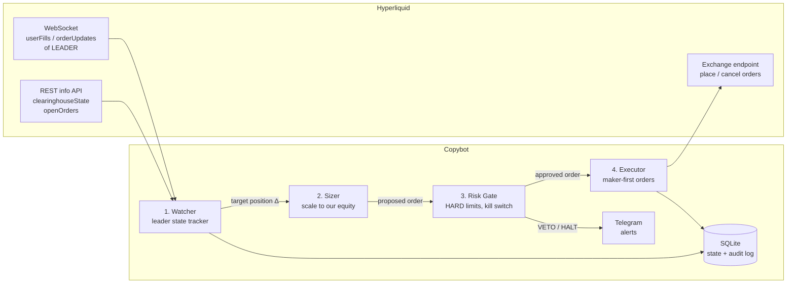
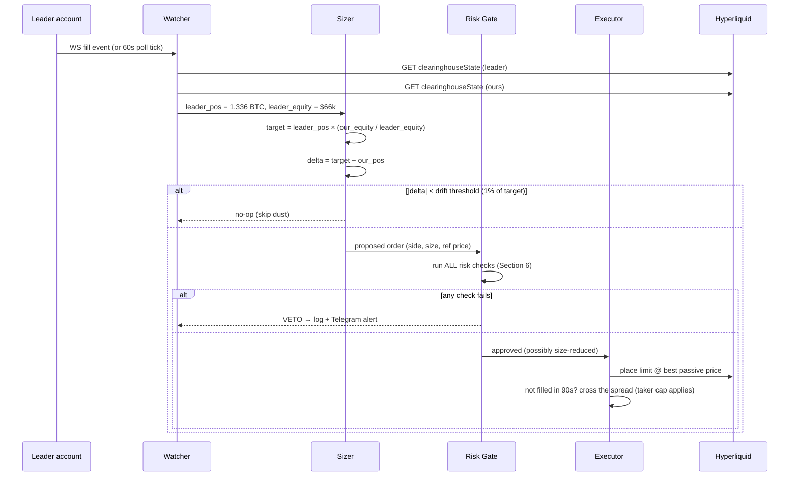
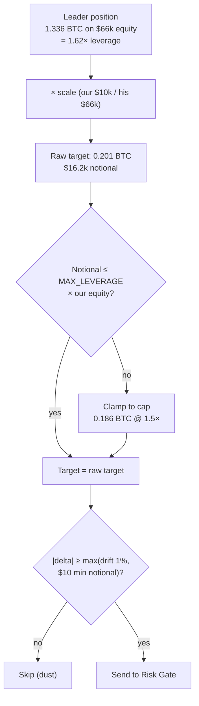
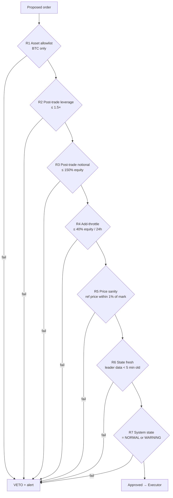
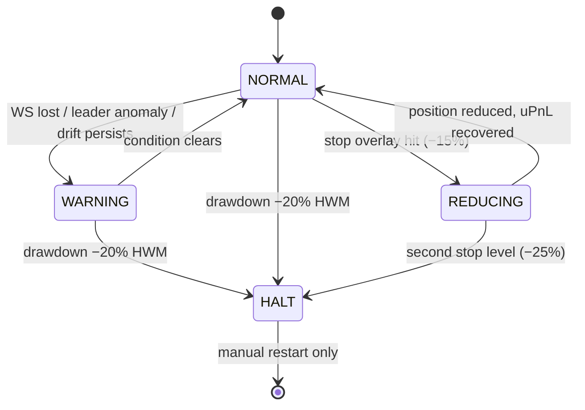

# PRD — Hyperliquid Copybot for `0xdae4...7637` ("Paul Wei")

**Status:** Draft v1 · 2026-08-27
**Repo:** `bankkomin/hyperliquid-copybot`
**Leader:** [`0xdae4df7207feb3b350e4284c8efe5f7dac37f637`](https://hyperbot.network/trader/0xdae4df7207feb3b350e4284c8efe5f7dac37f637) — BTC perp only, tracked at [paul.catseye.today](https://paul.catseye.today/)

---

## 1. Goal

Mirror the leader's BTC perp exposure on our own Hyperliquid account, scaled to our equity, **with a risk overlay the leader does not have**. Risk management and position sizing are the primary system functions — copying is secondary.

**Non-goals (v1):** multi-leader support, non-BTC assets, spot copying, a web dashboard, vault deposits.

---

## 2. What we learned about the leader (drives the whole design)

From 9 months of on-chain data (1,343 orders, 341 fills, Nov 2025 → Aug 2026):

| Fact | Number | Design consequence |
|---|---|---|
| Style | Long-only laddered accumulation ("grid"-looking) | Copy **position state**, not every fill |
| Maker fills | 84% | If we taker-copy, we pay costs he doesn't → maker-first execution |
| Realized grid PnL | ≈ +$500 net of funding+fees (noise) | The copyable alpha is the **directional position**, not the churn |
| Unrealized PnL | +$20.6k on 1.336 BTC @ $64,249 avg entry | Late copier buys HIS entry at TODAY's price — no entry-price edge |
| Stop losses | **ZERO** (no trigger orders, no TP/SL, ever) | **We must add our own stop overlay** |
| Behavior in drawdown | Averages down, pyramids size (0.05 → 0.20 BTC deeper) | Resting ladder would grow him ~40% bigger into a 28% crash — cap this |
| Fill frequency | ~1.2 fills/day, order batches every 1–2 days | Low-frequency; polling + WS both viable; latency is NOT critical |
| Funding paid | −$1,765 over 9 months (long perp) | Funding monitor needed; long-bias bleeds carry |

> **Key insight:** this leader survived because BTC V-shaped. A copybot that mirrors him 1:1 inherits an **uncapped average-down martingale with no stop**. The risk layer is not optional polish — it is the product.

---

## 3. System overview



Every order flows **Watcher → Sizer → Risk Gate → Executor**. Nothing reaches the exchange without passing the Risk Gate. The gate can only shrink or veto an order, never enlarge it.

---

## 4. Copy strategy: position-sync, not fill-mirror

Two standard approaches exist in open-source copybots:

| Approach | Used by | Fit here |
|---|---|---|
| **Fill-mirror** — react to each leader fill, replicate it | [zkOSAI](https://github.com/zkOSAI/hyperliquid-copy-trading-bot), [jestersimpps](https://github.com/jestersimpps/hyperliquid-copytrader) | ✗ We'd taker-cross on every maker fill he gets; misses fills during our downtime; drift accumulates |
| **Position-sync** — converge our position toward `leader_position × scale` | [MaxIsOntoSomething](https://github.com/MaxIsOntoSomething/Hyperliquid_Copy_Trader) (startup), jestersimpps (drift sync) | ✓ Self-healing, restart-safe, naturally deduplicates his ladder churn |

**Decision: position-sync is the source of truth.** WS fill events are just *triggers* to re-sync early; a poll timer (60s) is the fallback trigger. This is the same "drift sync" pattern jestersimpps uses (1% drift threshold), promoted from safety-net to primary mechanism.



**Explicitly NOT copied (v1):** the leader's *resting* order ladder (his 14 open buys $57.9k–$73.5k). We only mirror **filled exposure**. Rationale: mirroring resting orders commits our margin to his future average-down before it happens; position-sync picks up those buys anyway *if* they fill, and our risk gate then decides how much of them we take. Order-ladder mirroring is a Phase-2 option behind a config flag.

---

## 5. Position sizing (priority #1)

### 5.1 Core formula

```
scale        = our_equity / leader_equity          # both = perp accountValue, refreshed every sync
raw_target   = leader_position_btc × scale
target       = min(raw_target, POS CAP, LEV CAP)   # caps in Section 6
delta        = target − our_position_btc
order_size   = round_down(delta, sz_decimals)      # BTC: 5 decimals
```

Worked example at current state (our account = $10,000):

```
scale      = 10,000 / 66,435            = 0.1505
raw_target = 1.33557 × 0.1505           = 0.20103 BTC   (~$16.2k notional @ $80.5k)
lev check  = 16.2k / 10k = 1.62×  →  > MAX_LEVERAGE 1.5× → clamp
target     = (10,000 × 1.5) / 80,500    = 0.18634 BTC
```



### 5.2 Sizing rules

| # | Rule | Value (default) | Why |
|---|---|---|---|
| S1 | Equity ratio scaling | `our_equity / leader_equity`, live both sides | Same %-of-account exposure as leader — the standard across all referenced bots |
| S2 | Leverage clamp dominates | `MAX_LEVERAGE = 1.5×` (leader runs ~1.6× and his ladder would push it higher) | We copy his position, **not** his ladder-inflated future leverage |
| S3 | Min notional | $10 (Hyperliquid rule) + our own `MIN_ORDER_USD = 15` | Avoid dust churn; jestersimpps uses 11 |
| S4 | Drift threshold | 1% of target position | Don't chase every $ of equity fluctuation |
| S5 | Max single order | 25% of our equity notional | One bad sync can't dump our full size as one taker order |
| S6 | Rounding | Always round **down** | Never exceed the computed target |
| S7 | Increase-throttle | Position increases limited to `MAX_ADD_PER_DAY = 40%` of equity notional per 24h | Caps how fast we follow his average-down cascade in a crash |

S7 is the direct answer to his martingale ladder: if BTC crashes 28% in a day and all his resting buys fill, a naive copier adds ~40% more exposure into a falling knife within hours. The throttle spreads that across days and gives the drawdown kill-switch (R2) time to fire first.

---

## 6. Risk framework (priority #1, tied)

### 6.1 Hard gates — every order, in order, any failure = veto



### 6.2 Standing monitors (run continuously, independent of orders)

| # | Monitor | Trigger | Action |
|---|---|---|---|
| M1 | **Stop-loss overlay** (leader has none!) | Our position uPnL < **−15%** of equity | Reduce position 50% (maker-first, taker after 90s); repeat at −25% to flat |
| M2 | **Drawdown kill-switch** | Account equity < **−20%** from high-water mark | → HALT: cancel all orders, flatten, stop copying, require manual restart |
| M3 | Leader anomaly | Leader position changes > 50% in < 10 min, or flips short | Pause copying (WARNING), alert — his 16 short fills in 9 months were noise, a real flip is regime change |
| M4 | Funding bleed | Cumulative funding paid > 2% of equity per 30d | Alert only (he paid ~0.6%/mo peak) |
| M5 | Connection watchdog | WS silent > 5 min AND poll fails | → WARNING: cancel our resting orders (never leave unattended limits), keep position, alert |
| M6 | Divergence audit | `our_pos / scale` vs `leader_pos` differs > 5% | Force full re-sync; if it persists 3 cycles → WARNING + alert |

### 6.3 Risk state machine (same shape as the option bot's)



- **NORMAL** — full copying.
- **WARNING** — no new *increases*; decreases/closes still mirrored (never block risk reduction).
- **REDUCING** — stop overlay is working the position down; leader increases ignored.
- **HALT** — flat, no orders, manual intervention required. The bot must never auto-exit HALT.

---

## 7. Execution

Leader earns his economics by being 84% maker. We approximate:

1. Place a **GTC limit at the passive touch** (buy = best bid, sell = best ask).
2. Unfilled after **90 s** → cancel, re-place crossing the spread as IOC, with slippage cap **0.15%** from mark.
3. Fill or partial recorded in SQLite; partial remainder handled by the next sync cycle (position-sync makes retries free).

Closes triggered by risk monitors (M1/M2) skip step 1 patience: 30 s maker attempt, then taker. Getting out matters more than fee savings.

---

## 8. Configuration (single `config.yaml`)

```yaml
leader: "0xdae4df7207feb3b350e4284c8efe5f7dac37f637"
assets: ["BTC"]

sizing:
  mode: equity_ratio          # our_equity / leader_equity
  max_leverage: 1.5
  max_notional_pct: 150       # % of equity
  max_add_per_day_pct: 40
  min_order_usd: 15
  drift_threshold_pct: 1.0
  max_single_order_pct: 25

risk:
  stop_loss_upnl_pct: -15     # reduce 50%
  stop_loss_flat_pct: -25     # go flat
  max_drawdown_pct: -20       # HALT (from high-water mark)
  leader_staleness_max_s: 300
  funding_alert_pct_30d: 2.0

execution:
  maker_wait_s: 90
  maker_wait_close_s: 30
  taker_slippage_cap_pct: 0.15

mode: paper                   # paper | live  — paper is the default, always
telegram: { enabled: true }
```

---

## 9. Tech stack

Match the option bot's conventions — same developer, same review muscle memory:

- **Python 3.10+**, asyncio, official [`hyperliquid-python-sdk`](https://github.com/hyperliquid-dex/hyperliquid-python-sdk)
- **SQLite** for state + append-only audit log (every proposed/vetoed/placed/filled order)
- **structlog** JSON logging, **Pydantic** models, **pytest**
- Runs in `venv_new` (the bare `python` hijack gotcha applies here too)
- No dashboard in v1 — Telegram + the existing catseye tracker cover observability

```
src/
├── watcher.py        # WS subscribe + poll, leader/our state snapshots
├── sizer.py          # Section 5 — pure function, fully unit-tested
├── risk.py           # Section 6 — gates + monitors + state machine, pure where possible
├── executor.py       # Section 7 — order placement, maker-first
├── store.py          # SQLite audit log + HWM tracking
└── main.py           # async loop wiring
config.yaml
tests/
```

Sizer and risk gate are **pure functions** (state in → decision out) so every rule in Sections 5–6 gets a table-driven unit test.

---

## 10. Milestones

| Phase | Deliverable | Exit criteria |
|---|---|---|
| **M1 Shadow** | Watcher + Sizer + Risk Gate in `paper` mode; logs every would-be order | 2 weeks running; decisions match leader moves; zero crashes; risk vetoes reviewed |
| **M2 Live-small** | Executor live, account funded with **test-size capital only** | 2+ real synced round trips; drift < 1%; stop overlay fire-drilled on testnet |
| **M3 Hardened** | Watchdogs, HALT drill, Telegram, restart-recovery test (kill -9 mid-sync) | Restart converges to correct position with no duplicate orders |
| **M4 Optional** | Order-ladder mirroring flag, multi-leader, dashboard | Only if M2/M3 economics justify it |

**Paper mode first is non-negotiable** — MaxIsOntoSomething ships a simulated mode for exactly this reason, and it matches the option-bot's own paper-trade discipline.

---

## 11. Honest economics (set expectations before writing code)

- The leader's realized "grid" PnL over 9 months was ~breakeven after funding and fees. **The only thing worth copying is his directional BTC accumulation** — which a copier enters at *today's* price, not his $64k average.
- Copying costs we pay that he doesn't: taker fees + slippage on whatever fraction misses maker fills, plus the same funding bleed.
- Therefore the realistic value proposition is: *a disciplined, risk-capped way to hold laddered BTC long exposure that follows a proven accumulator's timing* — not a money printer. If backtested copy-P&L minus costs isn't clearly positive vs. simply holding BTC, the correct decision at M1 exit is to stop.

## 12. Open questions

1. Copy capital size for M2? (drives whether $10-min-notional rounding is even feasible at scale 0.05 BTC × small ratio)
2. Should M3 leader-flip-short be copied at all, or is this strictly a long-only mirror? (Default: long-only; shorts ignored.)
3. Mirror his resting ladder (Phase 2) — worth revisiting only if M2 shows we consistently miss his best maker fills.

## 13. References

- Leader tracker: [paul.catseye.today](https://paul.catseye.today/) · [Hyperbot profile](https://hyperbot.network/trader/0xdae4df7207feb3b350e4284c8efe5f7dac37f637)
- [jestersimpps/hyperliquid-copytrader](https://github.com/jestersimpps/hyperliquid-copytrader) — WS fill detection + drift-sync + balance-ratio sizing (Node/TS)
- [MaxIsOntoSomething/Hyperliquid_Copy_Trader](https://github.com/MaxIsOntoSomething/Hyperliquid_Copy_Trader) — Python, equity-ratio sizing, leverage adjustment, simulated mode, SQLite
- [chainstacklabs/hyperliquid-trading-bot](https://github.com/chainstacklabs/hyperliquid-trading-bot) — clean Hyperliquid Python SDK usage patterns + risk controls
- [hyperliquid-python-sdk](https://github.com/hyperliquid-dex/hyperliquid-python-sdk) — official SDK (WS subscriptions: `userFills`, `orderUpdates`; info: `clearinghouseState`)
